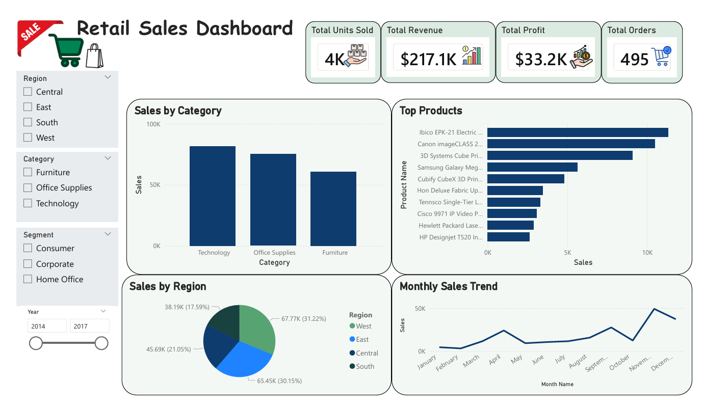

# 📊 Retail Sales Dashboard

## 📌 Overview

This project presents an interactive Power BI dashboard designed to analyze retail sales performance across different regions, product categories, and customer segments.

The dashboard provides valuable business insights through KPIs and interactive visualizations to support data-driven decision making.

---

## 🎯 Objectives

- Analyze retail sales performance.
- Monitor revenue, profit, and orders.
- Compare regional sales.
- Track monthly sales trends.
- Identify top-performing products.
- Analyze customer segments.

---

## 🛠️ Technologies


---

## 📊 Dashboard Preview



---

## 📈 Dashboard KPIs

- 💰 Total Revenue
- 📦 Total Orders
- 📈 Total Profit
- 🛒 Total Units Sold

---

## 📌 Dashboard Features

- Sales by Category
- Sales by Region
- Monthly Sales Trend
- Top Products
- Customer Segmentation
- Interactive Filters

---

## 📂 Project Files

```text
Retail-Sales-Dashboard
│
├── Retail-Sales-Dashboard.pbix
├── Retail-Sales-Dashboard.pdf
├── dashboard.png
└── README.md
```

---

## 👩‍💻 Author

**Yara El-Shamly**

Artificial Intelligence Graduate

- 💼 LinkedIn: https://www.linkedin.com/in/yara-elshamly-6427ba283
- 🐙 GitHub: https://github.com/YARA-ELSHAMLY
